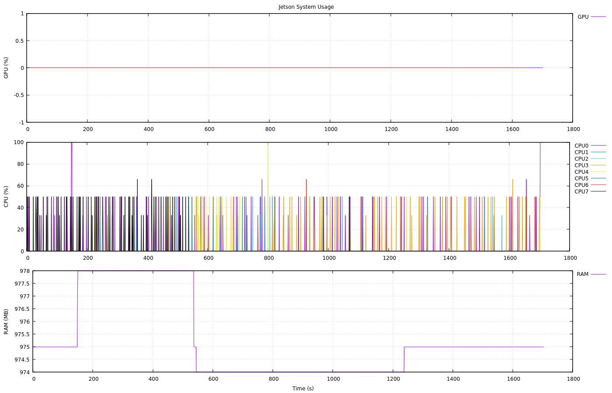

# Jetson TegraStats Plotter

使用 NVIDIA `tegrastats` 記錄G1 Jetson Orin CPU、GPU、RAM 等系統資源，並透過 Python 解析後使用 Gnuplot 繪圖。



## 1. 開始記錄

每 100 ms 記錄一次：

```bash
tegrastats --interval 100 > tegrastats_$(date +%Y%m%d_%H%M%S).log 2>&1 &
```
    

例如會產生：

```text
tegrastats_20260821_135119.log
```

## 2. 停止記錄

```bash
pkill tegrastats
```

確認是否已停止：

```bash
pgrep -a tegrastats
```

若沒有輸出，代表已停止。

## 3. 解析 Log

```bash
python tegra_plotter.py --log_path tegrastats_20260821_135119.log
```

程式會解析：

* GPU 使用率
* CPU0 ~ CPU7 使用率
* RAM 使用量(Unified memory)
* CPU / GPU 溫度

並產生供 Gnuplot 使用的：

```text
tegra_stats.dat
```

## 4. 繪圖

```bash
gnuplot -persist plot.gp
```

目前圖表包含：

* GPU Usage
* CPU0 ~ CPU7 Usage
* RAM Usage

## 安裝 Gnuplot

Ubuntu / Jetson：

```bash
sudo apt update
sudo apt install gnuplot
```

Headless 環境：

```bash
sudo apt install gnuplot-nox
```

## Workflow

```text
tegrastats
    ↓
*.log
    ↓
tegra_plotter.py
    ↓
tegra_stats.dat
    ↓
plot.gp
    ↓
GPU / CPU / RAM Plot
```

## Example

```bash
tegrastats --interval 10 > tegrastats_$(date +%Y%m%d_%H%M%S).log 2>&1 &

pkill tegrastats

python tegra_plotter.py --log_path tegrastats_20260821_135119.log

gnuplot -persist plot.gp
```

> `--interval 10` 表示每 10 ms 取樣一次，也就是 100 Hz。

     
tegrastats  output    
```
08-21-2026 15:11:33 RAM 998/15389MB (lfb 3313x4MB) SWAP 0/7694MB (cached 0MB) CPU [4%@883,0%@883,1%@883,0%@883,0%@729,0%@729,0%@729,0%@729] EMC_FREQ 0% GR3D_FREQ 0% GR3D2_FREQ 0%@0 CV0@54.156C CPU@56.843C SOC2@54.906C SOC0@56.031C CV1@54.093C GPU@54.375C tj@57.468C SOC1@57.468C CV2@54.281C

```
CPU GPU共用RAM
Unified Memory（統一記憶體架構）


| 欄位                | 意義                             | 你的例子                       |
| ----------------- | ------------------------------ | -------------------------- |
| `RAM 961/15389MB` | 系統共享記憶體使用量 / 總量                | 用了 961 MB / 15.4 GB        |
| `lfb 3300x4MB`    | 最大連續可用記憶體區塊資訊                  | 約有 3300 個 4 MB free blocks |
| `SWAP 0/7694MB`   | Swap 使用量 / 總量                  | 0 / 7.7 GB                 |
| `cached 0MB`      | Swap cache                     | 0 MB                       |
| `CPU [...]`       | 每個 CPU core 使用率與時脈             | `0%@1984` = 0%，1984 MHz    |
| `EMC_FREQ 0%`     | External Memory Controller 使用率 | 幾乎沒有記憶體頻寬負載                |
| `GR3D_FREQ 0%`    | GPU 3D engine 使用率              | GPU 使用率 0%                 |
| `GR3D2_FREQ`      | 第二個 GPU/GPC 相關統計，依 Jetson 型號而異 | `0%@0`                     |
| `CPU@58.5C`       | CPU 溫度                         | 58.5°C                     |
| `GPU@56.062C`     | GPU 溫度                         | 56.1°C                     |
| `SOCx`            | SoC 不同區域溫度                     | 約 56~59°C                  |
| `CVx`             | Computer Vision engine 區域溫度    | 約 55~56°C                  |
| `tj@59.281C`      | Junction temperature，晶片內部代表性溫度 | 約 59.3°C                   |

## On-board computer

G1-EDU onboard standard with **1 operation and control computing unit**, and one **development computing unit**.

| Parameter | Development computing unit (PC 2) |
|---|---|
| Model | Jetson Orin NX |
| CPU | Arm® Cortex®-A78AE |
| Number of cores | 8 |
| Number of threads | 8 |
| Max largest rate | 2 GHz |
| Graphic memory | 16G |
| Memory | 16G |
| Cache | 2MB L2 + 4MB L3 |
| Storage | 2T |
| Intel® Image Processing Unit | No |
| GPU | 1024 NVIDIA Ampere architecture GPUs with 32 Tensor cores |
| Maximum dynamic frequency of graphics card | 918 MHz |
| Gaussian and Neuro Accelerator | 3.0 |
| Intel® deep learning promotion | Yes |
| Intel® Adaptix™ Technology | Yes |
| Intel® hyperthreading technology | Yes |
| Instruction set | 64bit |
| OpenGL | 4.6 |
| OpenCL | 3.0 |
| DirectX | 12.1 |
| IP address | 192.168.123.164 |


